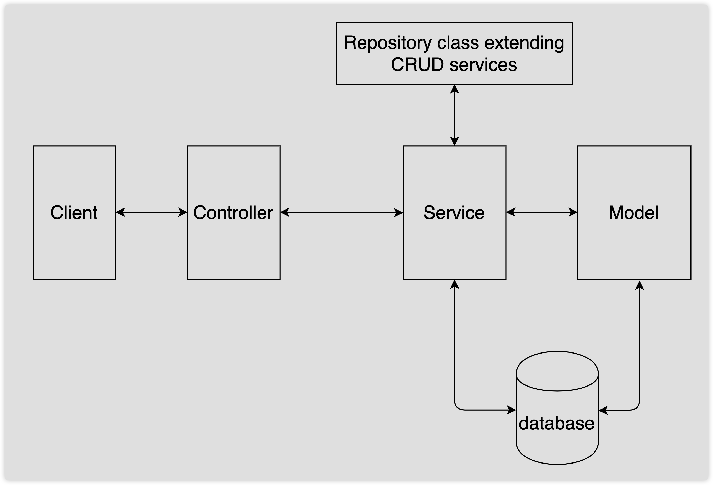
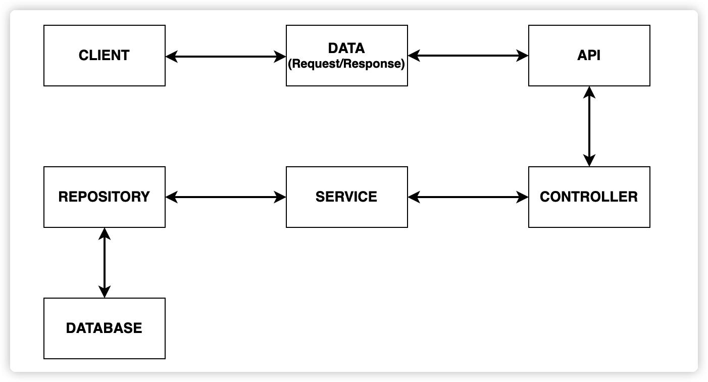

# E-Commerce

## Architecture

### Model
A Model is a basic entity that has a direct relationship with the structure of a table in the database. In other words, models serve as containers that hold similar and relative data that are used to transport these data from clients to the database. User Profile, Product, and Category are some models in our back-end application.

### Repository
A repository is an interface that acts as a bridge between the database and the application. It carries the model data to and from the database. Every model will have a unique repository for data transportation.

### Service
A Service is the part of the architecture where the repository is instantiated, and business logic is applied. The data from the client reaching here is manipulated and sent through the repository to the database.

### Controller
A controller is the part of the architecture where the requests from the clients are first handled. It controls the processes that should run on the back-end and the response that has to be sent to the clients. It interacts with the service, which interacts with the repository, which interacts with the database using models.

## Journey of Data

> Note: The repository talks to the model, the service talks to the repository, and the controller talks to the service.